# 🧙 Lug Deploy Tracker (Beta)

 

**Beta version of a 100% native Salesforce solution to visually track, analyze and review deployment activity over time**, complementing Salesforce’s default DeployRequest retention with extended historical tracking.  
It also allows you to easily review **deployed components**, quickly identify **failed deployments**, access **deployment status** directly from deployment result records, and gain deeper visibility into your deployment process.

## Installation 📥

You can install **Lug Deploy Tracker** in your Salesforce org using one of the following links:

  
  

---

## Overview ✨

**Lug Deploy Tracker** is a Salesforce solution designed to track and analyze deployment activity by retrieving `DeployRequest` data via the Tooling API.  

It provides advanced scheduling, synchronization, and reporting features to help administrators and developers gain full visibility into past deployment activity.

This app is **heavily inspired** (in spirit and in look & feel) by the great [Nebula Logger](https://github.com/jongpie/NebulaLogger) — though much simpler and focused on deployment tracking.  
Some structural and UI ideas are also borrowed from [chat-gpt-sfdc](https://github.com/ArnasBaronas/chat-gpt-sfdc), a very well-structured LWC Salesforce project.

https://github.com/user-attachments/assets/6962e1a8-2d20-4228-b34d-bcf2e615607b

---

### Features ⚙️

- 🔍 Synchronize `DeployRequest` records using the Tooling API.
- 📊 Store detailed deployment results in custom objects:
  - `DeployResult__c`
  - `DeployResultComponent__c`
  - `DeployResultTest__c`
- ⏰ Configure automatic synchronization frequency (daily, hourly).
- 🎛️ View and manage settings via **Lightning Web Components** (LWC):
  - Schedule settings
  - Advanced options
  - Manual synchronization
- 🚥 Track progress of batch synchronization via Platform Events and progress bar.
  
---

## Dashboard Example 📊

Here's a visual example of a full Deployment Dashboard built using the results provided by this app, with filters for **time range** and **deployment status**.

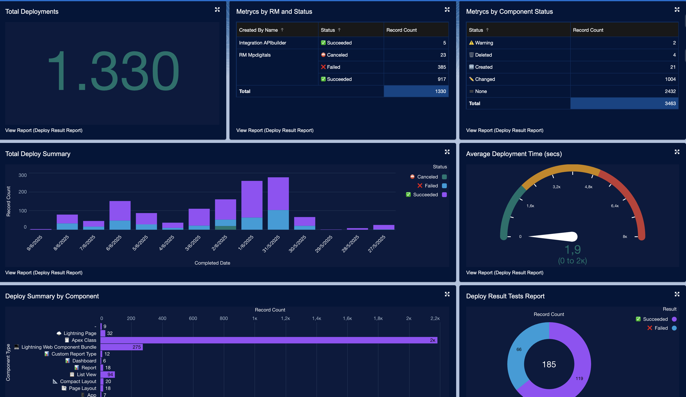

---

## Installation Steps 🛠️

1. **Before using the app, you must create a Named Credential** for Tooling API access.

👉 [How to create a Named Credential](https://help.salesforce.com/s/articleView?id=platform.perm_uapa_create_a_named_credential.htm&type=5)

2. **After installing Lug Deploy Tracker:**

- Open the app via **App Launcher**.
- Go to the **Advanced Options** tab.

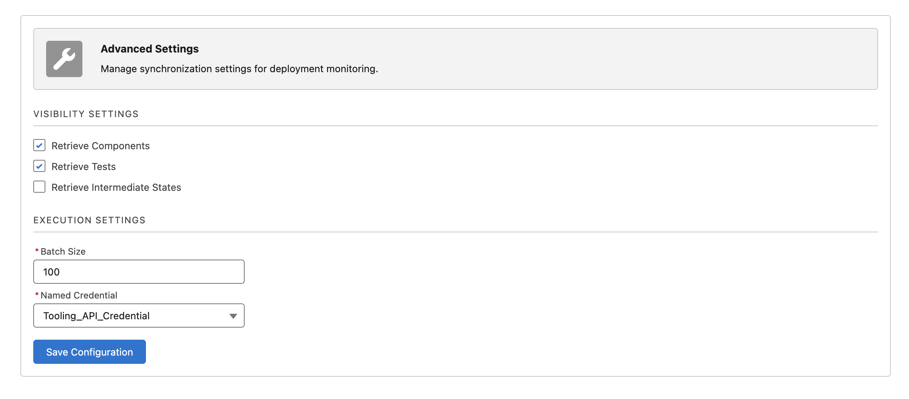

- Select the Named Credential you just created.
- Configure advanced options:
    - Retrieve Components
    - Retrieve Tests
    - Retrieve Intermediate States
- Assign the **DeployAdminAccess** permission set to any users who should have access to the Lug Deploy Tracker app.

---

## Usage 🖥️

### Manual Synchronization

You can trigger sync manually by using the **Synchronization Settings** tab.

- If the **Start Date** field is left empty, the app will automatically retrieve data from the last 30 days.
- If the **End Date** field is left empty, the app will retrieve data up to today.

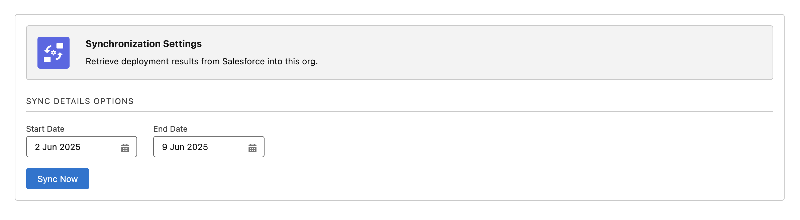

### Scheduled Synchronization

You can also configure periodic automatic sync:

- If you schedule synchronization to start at 16:00 with a frequency of 2 hours, the app will automatically retrieve DeployRequests from the last 2 hours starting from 16:00, and will repeat this process every 2 hours.
- The next scheduled execution time is always displayed in the form.

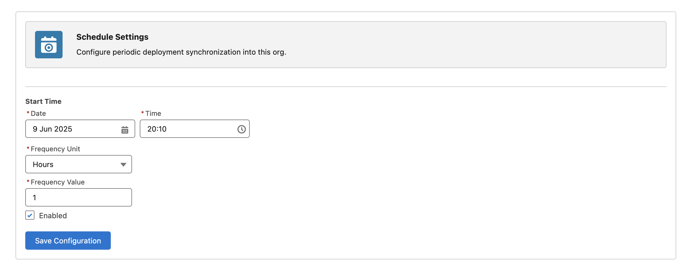

---

## Visual Results 🔍

### Deploy Results

Overview of the captured `DeployResult__c` records:

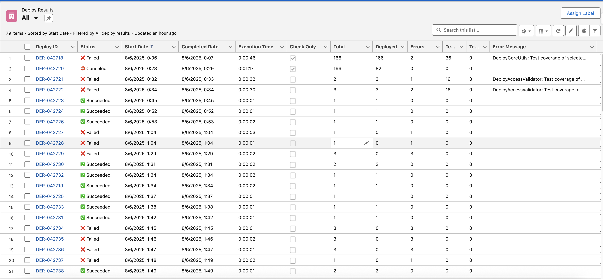

### Deploy Result Details

Example of a `DeployResult__c` record details page:

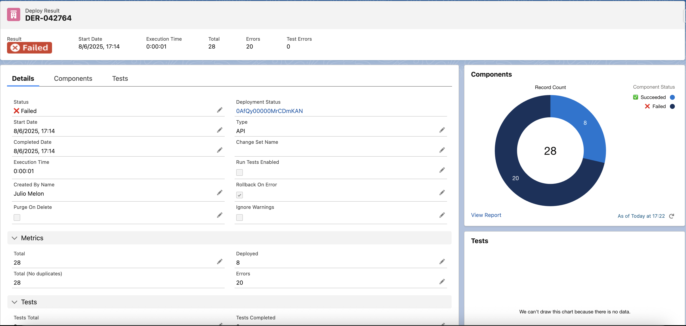

### Deploy Result Components

List view of `DeployResultComponent__c` records:

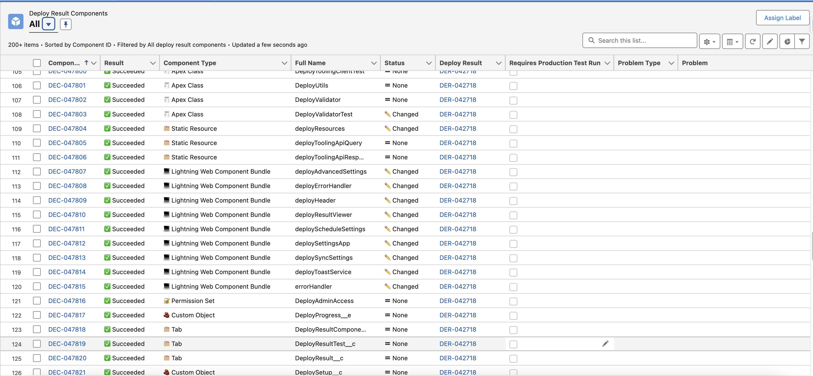

### Deploy Result Components Related List

Related List of components on a `DeployResult__c` record:

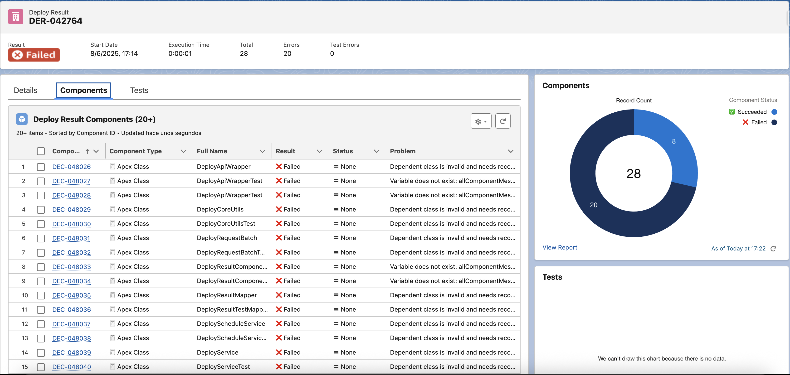

### Deploy Result Tests

List view of `DeployResultTest__c` records:

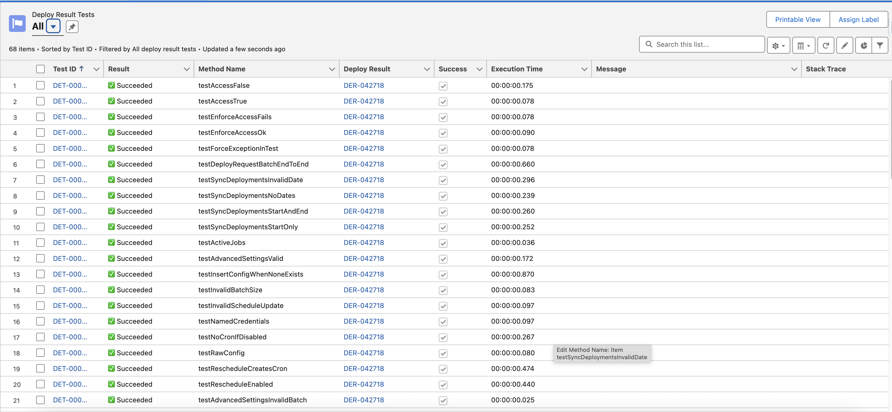

### Deploy Result Tests Related List

Related List of tests on a `DeployResult__c` record:

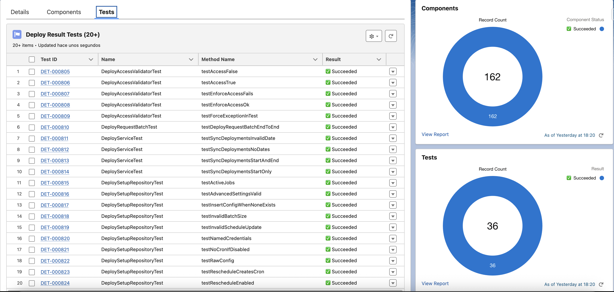

---

## Architecture Overview 🏗️

**This Salesforce Diagrams template (deploy_schema) shows how LugDeployTracker uses asynchronous batch processing with Tooling API and Platform Events to synchronize and track DeployRequest data.** Progress events (DeployProgress__e) are published after commit and consumed in real time by a Lightning Web Component to display batch progress.

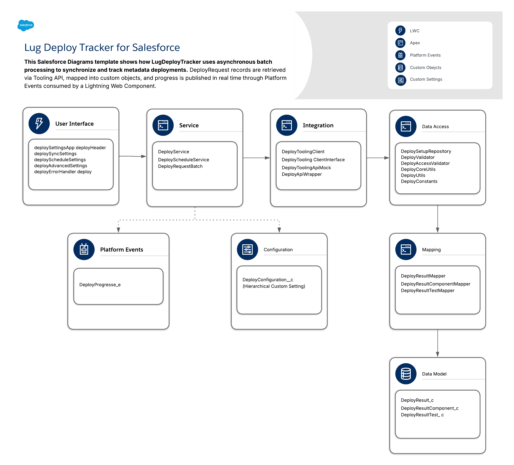

---

### Frontend (LWC)

### User Interface Layer

- `deploySettingsApp` — Main container app
- `deployHeader` — Application header
- `deploySyncSettings` — Manual synchronization UI
- `deployScheduleSettings` — Schedule settings (start date, unit, frequency)
- `deployAdvancedSettings` — Advanced options (batch size, named credential, intermediate states)
- `deployErrorHandler` — Reusable error handling component
- `deployToastService` — Reusable toast notification service

### Backend (Apex)

#### Service Layer

- `DeployService` — Entry point for synchronization logic (called by LWC)
- `DeployScheduleService` — Handles schedule logic (`System.schedule`)
- `DeployRequestBatch` — Batch Apex that performs DeployRequest synchronization (Tooling API)
- `DeployServiceTest` and related test classes — Test coverage

#### Integration Layer

- `DeployToolingClient` — Integration with Salesforce Tooling API (fetch DeployRequest and DeployResult data)
- `DeployToolingClientInterface` — Interface for Tooling Client
- `DeployToolingApiMock` — Mock for Tooling API tests

#### Data Access Layer

- `DeploySetupRepository` — Manages configuration data and settings persistence (Custom Setting)
- `DeployValidator` — Validates configuration and access
- `DeployAccessValidator` — Validates user access permissions
- `DeployCoreUtils` — Core utility functions for configuration management, cron scheduling, and integration with scheduling services  
- `DeployUtils` — Utility functions (MD5 hashing, cron generation, date utils, etc.)
- `DeployConstants` — Centralized constants (configuration and error messages)

#### Data Mapping Layer

- `DeployApiWrapper` — Deserializes Tooling API responses into wrapper objects (DeployRequest, Result, Details, Components, Tests)
- `DeployResultMapper` — Maps `DeployResult__c` from Tooling API data
- `DeployResultComponentMapper` — Maps `DeployResultComponent__c` from Tooling API data
- `DeployResultTestMapper` — Maps `DeployResultTest__c` from Tooling API data

### Platform Events

- **Progress Events** — The batch process publishes progress updates through the `DeployProgress__e` Platform Event, which drives the live progress bar in the LWC during synchronization.

### Data Model

#### Custom Objects

- `DeployResult__c` — Deployment master record
- `DeployResultComponent__c` — Deployed components (per DeployResult)
- `DeployResultTest__c` — Test results (per DeployResult)

#### Configuration

- `DeployConfiguration__c` — Hierarchical Custom Setting (used for operational state during execution and by the LWC)

---

## Next Steps 🚀

Planned features for upcoming versions:

- ⚙️ **Handling Partial Results in Batch Apex** to improve resilience on very large datasets.
- 🗑️ **Purge management**: implement automatic cleanup of old `DeployResult__c` records after configurable retention period.
- 📈 **Lines covered / FlowCoverage**: expose visual coverage metrics for both code and flows.
- 🗂️ **Component and Test Class Summary Views**:
  - Provide a clear **list of component names** that have errors or warnings (without duplicating full line-by-line error already detailed).
  - Provide a clear **list of test classes** that have errors or coverage warnings (without showing individual test methods, which are already detailed).
    
---

## Disclaimer ⚠️

This package is provided "as is", without warranties or guarantees of any kind, either express or implied.  
You assume full responsibility for any outcomes resulting from its use. The author and contributors shall not be liable for any direct, indirect, incidental, or consequential damages, or any data loss arising from the use of this package in any Salesforce environment (production or sandbox).

---

## Contact & Feedback 📬

Feedback, ideas, and contributions are very welcome!  
Feel free to reach out:

📧 **develop@mpdigitals.com**
